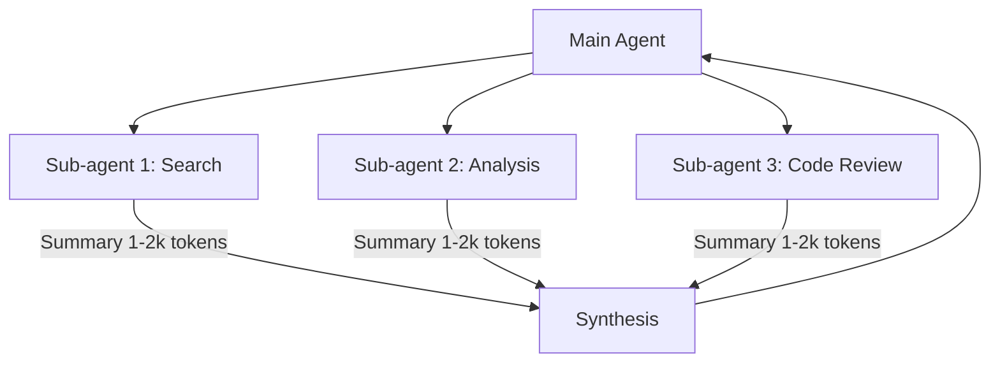

# Context Engineering

Strategies for curating and managing context in long-running AI agents.

> "Context engineering is the art and science of curating what will go into the limited context window."
> — Anthropic

## Overview

| Concept                     | Description                                         | Use Case                            |
| --------------------------- | --------------------------------------------------- | ----------------------------------- |
| **Prompt Engineering**      | Writing effective prompts (system prompts)          | One-shot tasks                      |
| **Context Engineering**     | Managing entire context state across multiple turns | Long-running agents                 |
| **Compaction**              | Summarizing and compressing context to continue     | Context window limits               |
| **Structured Note-taking**  | Persisting notes outside the context window         | Multi-hour tasks, progress tracking |
| **Sub-agent Architectures** | Specialized sub-agents with clean context windows   | Complex research, parallel tasks    |

---

## Why Context Engineering Matters

### Context Rot

As tokens increase, recall accuracy decreases. This is called **context rot**.

```
Token Count vs. Recall Accuracy

Low tokens   ████████████████ High accuracy
Medium       ██████████░░░░░░ Moderate
High tokens  ████░░░░░░░░░░░░ Low accuracy (context rot)
```

### Key Insight

> "Context must be treated as a finite resource with diminishing marginal returns."

**Principle:** Find the smallest set of high-signal tokens that maximize the likelihood of desired outcomes.

---

## Techniques

### 1. Compaction

**Summarize context when approaching limits, reinitialize with summary.**

#### When to Use

- Context window is 70-80% full
- Long conversation with accumulated tool outputs
- Need to continue with fresh focus

#### Implementation

```
Original Context (90% full):
- System prompt
- 50 conversation turns
- 100 tool call results
- Accumulated state

    ↓ Compaction

Compacted Context (30% full):
- System prompt (preserved)
- Summary of key decisions
- Unresolved issues
- 5 most recent files/resources
```

#### What to Keep vs. Discard

| Keep (High Signal)              | Discard (Low Signal)         |
| ------------------------------- | ---------------------------- |
| Architectural decisions         | Verbose tool outputs         |
| Unresolved bugs/issues          | Completed successful tasks   |
| Critical implementation details | Redundant conversation turns |
| Current goals and constraints   | Exploratory dead-ends        |

#### Anthropic's Tip

> "Start by maximizing recall to ensure your compaction prompt captures every relevant piece of information, then iterate to improve precision by eliminating superfluous content."

---

### 2. Structured Note-taking (Agentic Memory)

**Persist notes outside the context window for later retrieval.**

#### When to Use

- Multi-hour tasks with clear milestones
- Progress tracking across context resets
- Learning and improvement over time

#### Implementation Patterns

```
Pattern A: File-based Memory
└── NOTES.md or TODO.md persisted to disk

Pattern B: Structured JSON
└── state.json with typed fields

Pattern C: Key-Value Store
└── Database or MCP memory tool
```

#### Example: NOTES.md

```markdown
# Agent Notes

## Current Objective

Training Pikachu to level 25 in Route 1

## Progress

- Steps completed: 1,234
- Pikachu level: 18 → 23 (+5)
- Remaining: 2 levels

## Learned Strategies

- Thunder Shock effective vs. Pidgey
- Avoid Rattata (wastes HP)

## Next Actions

1. Continue grinding until level 25
2. Move to Route 2
```

#### Benefits

- Survives context resets
- Agent can read own notes and continue
- Enables long-horizon coherence

---

### 3. Sub-agent Architectures

**Delegate to specialized sub-agents with clean context windows.**

#### When to Use

- Complex research requiring deep exploration
- Parallel exploration of multiple paths
- Need to isolate detailed work from main context

#### Architecture



#### Key Pattern

| Sub-agent Work          | Return to Main Agent      |
| ----------------------- | ------------------------- |
| 50,000+ tokens explored | 1,000-2,000 token summary |
| Deep file reading       | Key findings only         |
| Multiple tool calls     | Synthesized conclusions   |

#### Benefits

- Clean separation of concerns
- Detailed search context stays isolated
- Main agent focuses on synthesis

---

## Just-in-Time Context Retrieval

**Load context dynamically at runtime instead of pre-loading everything.**

### Pattern

```
Traditional (Pre-load):
1. Load all relevant files into context
2. Process
3. Respond
→ Wastes context on unused information

Just-in-Time:
1. Keep lightweight references (file paths, queries, links)
2. Load specific data when needed
3. Discard after use
→ Efficient, focused context
```

### Implementation

```python
# Instead of loading entire codebase:
context = read_all_files("src/")  # ❌ Wasteful

# Use just-in-time retrieval:
relevant_files = grep_search("function_name")  # ✅ Targeted
context = read_file(relevant_files[0])         # ✅ On-demand
```

### Progressive Disclosure

> "Agents can assemble understanding layer by layer, maintaining only what's necessary in working memory."

---

## Hybrid Strategy

**Combine pre-retrieval and just-in-time for optimal performance.**

### Example: Claude Code Approach

| Pre-loaded (Upfront)             | Just-in-Time (On-demand)      |
| -------------------------------- | ----------------------------- |
| CLAUDE.md / copilot-instructions | File contents via glob/grep   |
| Project structure overview       | Specific function definitions |
| Key configuration                | Test results, logs            |

### Decision Matrix

| Task Characteristic          | Strategy     |
| ---------------------------- | ------------ |
| Static reference docs        | Pre-load     |
| Dynamic file contents        | Just-in-time |
| Frequently accessed          | Pre-load     |
| Rarely accessed              | Just-in-time |
| Large volume, low relevance  | Just-in-time |
| Small volume, high relevance | Pre-load     |

---

## Split / Compact / Reference Loop

When workflow assets keep growing, do not default to adding another agent or another long instruction block.

Use this order instead:

1. **Split**
   Separate responsibilities, phases, or heavy examples that are polluting the main context.
2. **Compact**
   Rewrite repeated guidance into a smaller rule or decision point.
3. **Referenceize**
   Move deep recipes, long tables, and infrequent detail into files loaded on demand.

### Practical Rule of Thumb

| Symptom                                        | First Move                                           |
| ---------------------------------------------- | ---------------------------------------------------- |
| Main file keeps gaining new sections           | Compact existing sections before adding              |
| Same rule appears in multiple headings         | Merge into one SSOT section                          |
| Long examples dominate the file                | Move examples to `references/`                       |
| Deep detail is only needed occasionally        | Keep a summary in main context and link out          |
| Context usage rises because of static guidance | Trim always-loaded files before adding orchestration |

### Apply to Customization Files

For `.instructions.md`, `.prompt.md`, `.agent.md`, and `SKILL.md`:

- Keep the routing surface and decision points in the main file
- Move recipes, variants, and long examples into references
- Prefer a curated small external-links section over a giant link dump in the main file
- Treat append-only growth as a smell, not as normal maintenance

For always-loaded workspace entry files such as `.github/copilot-instructions.md`:

- Keep only repo-wide routing and a few global guardrails in the entry file
- Move domain workflows, review rules, upload procedures, and long failure playbooks into dedicated `.github/instructions/**/*.instructions.md`
- Do not turn the entry file into a Markdown-linked index of rules, skills, or docs. Even when the body stays short, linked references can still make the entry behave like a heavy context surface
- If the entry file starts mixing persona, routing, workflow details, and domain-specific prohibitions, treat that as context-hoarding rather than good documentation
- If removing or renaming the entry file suddenly makes casual chat behave normally again, that is a strong signal the entry file has become too heavy for its role

---

## Long-Horizon Task Checklist

```markdown
## Context Engineering Checklist

### Before Starting

- [ ] Is this a long-horizon task (>30 min continuous work)?
- [ ] Will context window likely fill up?
- [ ] Are there clear milestones to track?

### Technique Selection

- [ ] **Compaction**: Set up summarization trigger at 70% context
- [ ] **Note-taking**: Create NOTES.md or state file
- [ ] **Sub-agents**: Identify tasks suitable for delegation

### During Execution

- [ ] Monitor context usage
- [ ] Write notes at milestones
- [ ] Compact when needed
- [ ] Use just-in-time retrieval for large data

### After Completion

- [ ] Archive notes for future reference
- [ ] Document lessons learned
```

---

## 4. Instruction File Optimization

**Reduce token cost of definition files that are loaded into every session.**

`.instructions.md`, `.prompt.md`, `.agent.md` are loaded in full on every conversation turn. Verbose files waste tokens before the task even starts.

### What to Keep vs. Remove

| Keep (AI can't know this)                  | Remove (AI already knows)                 |
| ------------------------------------------ | ----------------------------------------- |
| User-specific facts: IDs, paths, env names | Command syntax (`az login`, `git commit`) |
| Policies & conventions unique to the team  | Error-handling recipes                    |
| Workflow intent & delegation rules         | Step-by-step tutorials                    |
| Identifiers (subscription IDs, tenant IDs) | Checklists of general best practices      |

### Loading Locations (VS Code Copilot)

| Scope     | Path                                              |
| --------- | ------------------------------------------------- |
| Global    | `%APPDATA%/Code/User/prompts/*.instructions.md`   |
| Workspace | `.github/copilot-instructions.md`                 |
| Workspace | `.github/instructions/**/*.instructions.md`       |
| Workspace | `.github/prompts/*.prompt.md / *.agent.md`        |
| Workspace | `.vscode/settings.json` (`github.copilot.chat.*`) |

Duplicate content across global and workspace scopes doubles token cost.

### Checklist

- [ ] Each file contains only user-specific / AI-unknowable information
- [ ] No duplicate content between global and workspace scopes
- [ ] All `.prompt.md` files have a `description` frontmatter
- [ ] Stale IDs, paths, or settings removed
- [ ] No conflicting instructions across files
- [ ] Workspace entry files still read like a short routing layer, not like a full operating manual

### Red Flags

| Smell                                                                                | Why it hurts                                                                             |
| ------------------------------------------------------------------------------------ | ---------------------------------------------------------------------------------------- |
| `.github/copilot-instructions.md` keeps absorbing workflow-specific sections         | The file is loaded too often to be a safe place for deep procedure detail                |
| The same rule appears in the entry file and again in domain instructions             | Duplicate always-loaded guidance increases token cost and conflict risk                  |
| The entry file becomes a Markdown-linked catalog of instructions, agents, or docs    | Even with a short body, the entry can still act like a large retrieval surface           |
| Persona, routing, task policy, and domain-specific operations are all mixed together | The agent spends context budget resolving instruction priority before it can do the task |
| Casual chat improves only after disabling the workspace entry file                   | The entry file is likely over-scoped rather than merely verbose                          |

### Diagnosis Order

When workspace behavior becomes unstable, do not jump straight to `AGENTS.md` mismatch.

Check in this order:

1. Is the always-loaded workspace entry file (`.github/copilot-instructions.md`) trying to do too many jobs at once?
2. Is the same rule duplicated across entry file, domain instructions, and prompt / agent assets?
3. Has the entry file become a Markdown-linked index that keeps pulling deeper material into the conversational surface?
4. Only after that, check whether `AGENTS.md` and agent definitions disagree about workflow entry points or role boundaries.

Reason:

- `AGENTS.md` inconsistency can matter, but over-scoped always-loaded instructions usually create broader symptoms first, especially when casual chat normalizes as soon as the entry file is removed or renamed.

---

## Anti-Patterns

| Anti-Pattern             | Problem                                         | Solution                      |
| ------------------------ | ----------------------------------------------- | ----------------------------- |
| **Context Hoarding**     | Loading everything "just in case"               | Just-in-time retrieval        |
| **No Compaction**        | Running until context exhausted                 | Proactive summarization       |
| **Stateless Loops**      | Forgetting progress on reset                    | Structured note-taking        |
| **Monolithic Agent**     | One agent doing everything                      | Sub-agent delegation          |
| **Premature Retrieval**  | Loading data before knowing needs               | Lazy loading                  |
| **Verbose Instructions** | Definition files bloated with general knowledge | Instruction file optimization |

---

## References

- [Effective context engineering for AI agents - Anthropic](https://www.anthropic.com/engineering/effective-context-engineering-for-ai-agents)
- [Building effective agents - Anthropic](https://www.anthropic.com/engineering/building-effective-agents)
- [How we built our multi-agent research system - Anthropic](https://www.anthropic.com/engineering/multi-agent-research-system)
